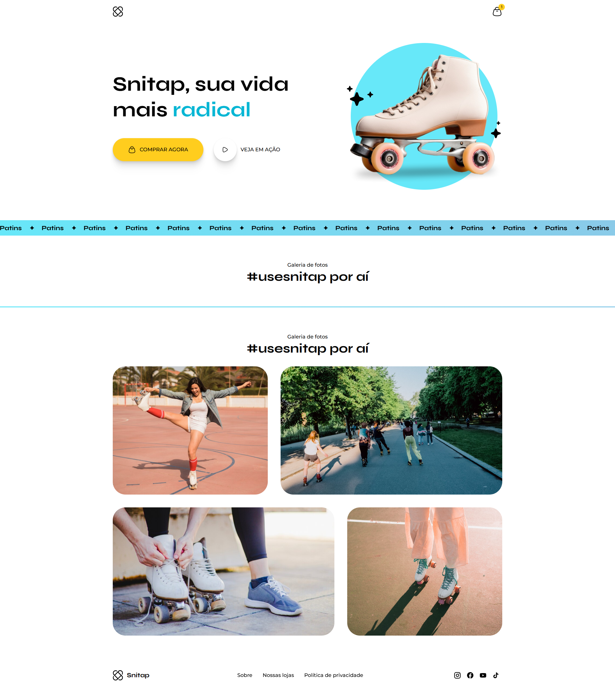

# Snitap



## 🌍 Sobre o projeto

O **Snitap** é um projeto dinâmico e vibrante que traz para você a experiência radical de patinar. Com um design moderno e recursos envolventes, Snitap visa proporcionar aos usuários uma experiência única, incentivando a comunidade a se conectar através do amor pelo patins.

----------

## ✨ Funcionalidades principais
    
-   📹 **Galeria de Fotos**: Veja e compartilhe momentos incríveis da comunidade Snitap com a hashtag #usesnitap.
    
-   🛍️ **Compra Fácil**: Compre seus patins favoritos com apenas alguns cliques e esteja pronto para a próxima aventura.
    

----------

## 📊 Tecnologias utilizadas

O projeto foi desenvolvido utilizando as seguintes tecnologias para garantir uma experiência fluida e visualmente atraente:

-   **HTML**: Estrutura semântica e conteúdo do site.
    
-   **CSS**: Estilização visual, layout e animações envolventes para uma interação dinâmica.

----------

## 🔧 Como rodar o projeto

Para executar o Snitap localmente, siga os passos abaixo:

1.  **Clone o repositório**:
    
    ```
    git clone https://github.com/seu-usuario/snitap.git
    cd snitap
    ```
    
2.  **Abra o arquivo HTML**:
    
    Abra o arquivo `index.html` em seu navegador para visualizar o projeto.

----------

Explore a aventura radical com Snitap e compartilhe seus momentos favoritos com a comunidade! 🛶
